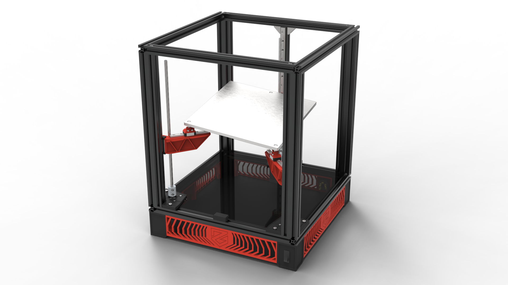
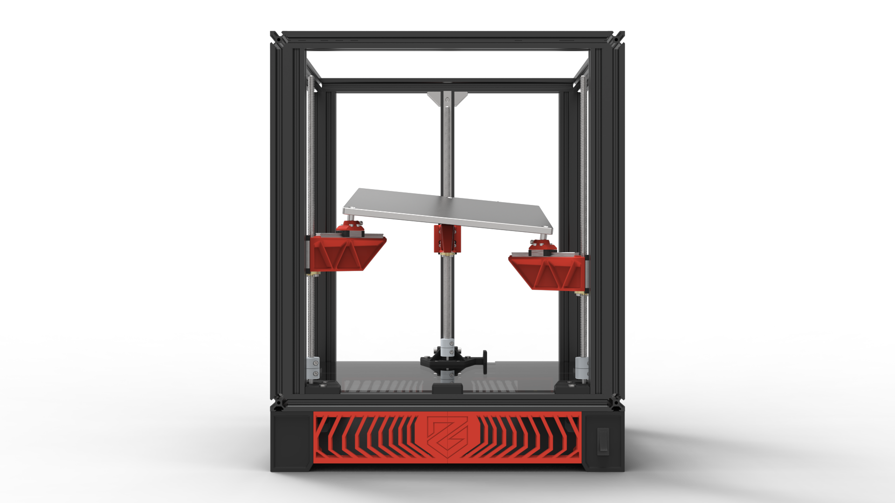
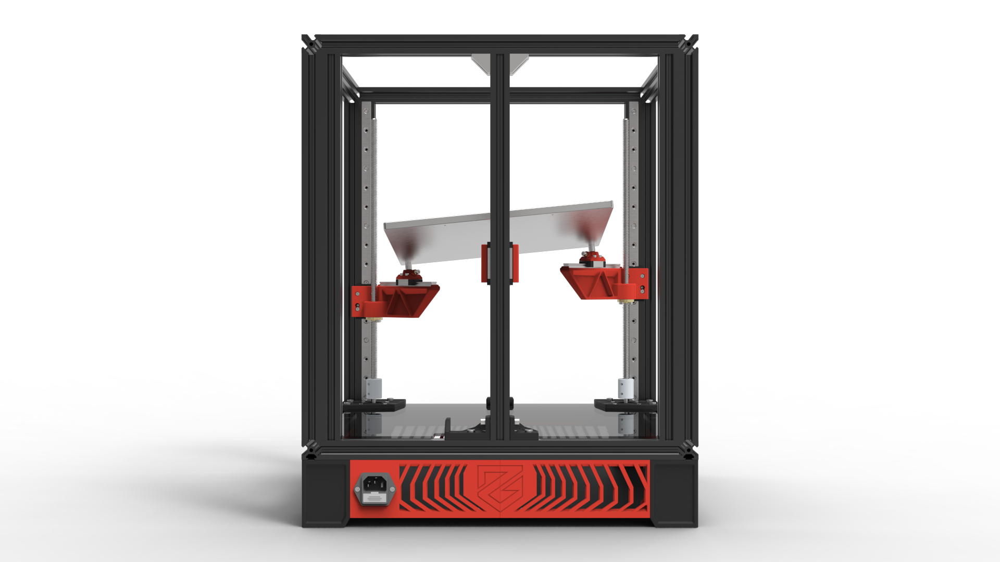
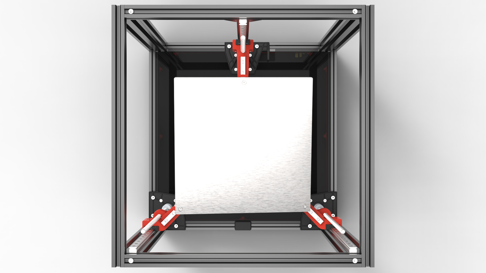
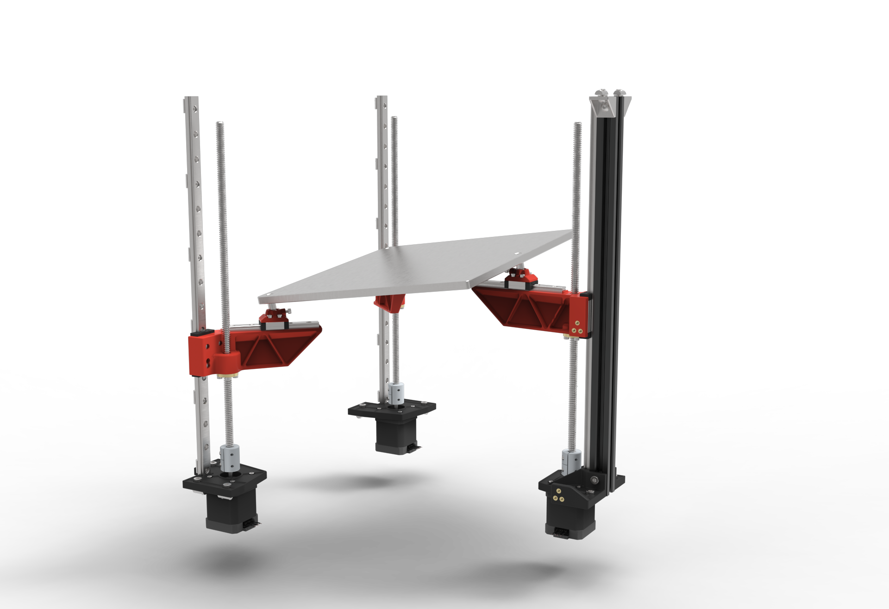
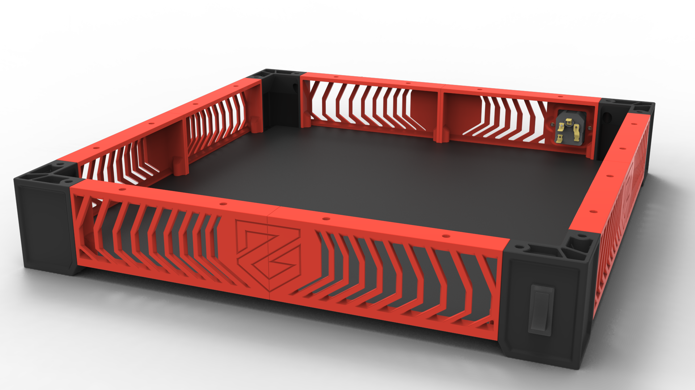
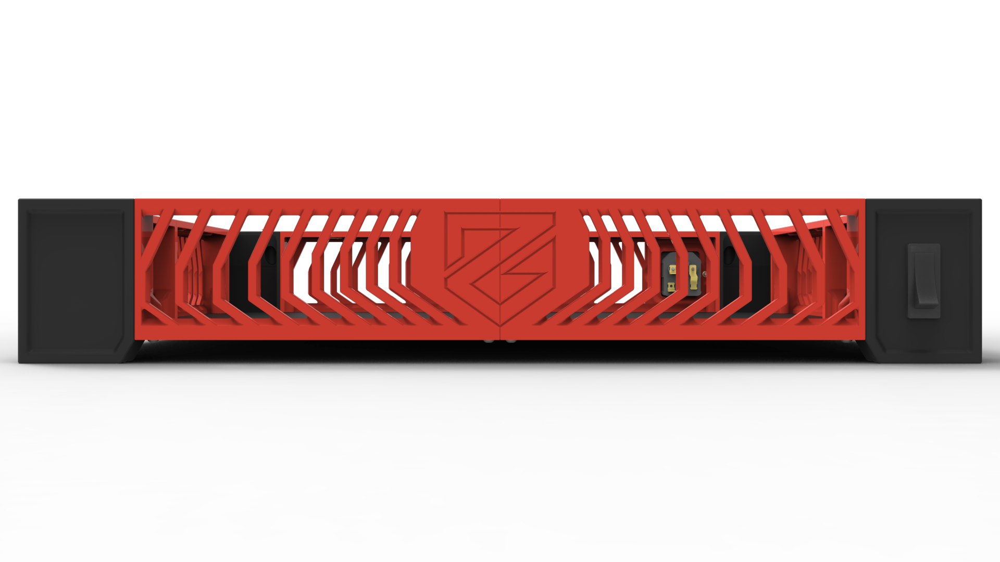
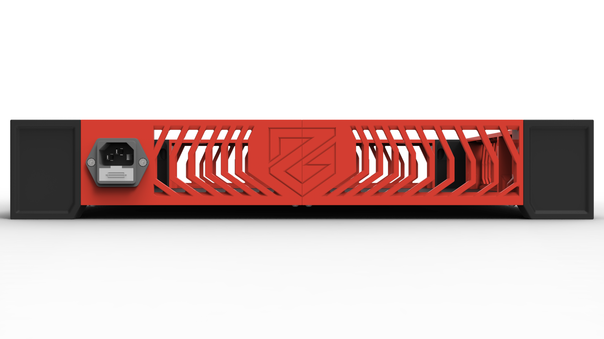
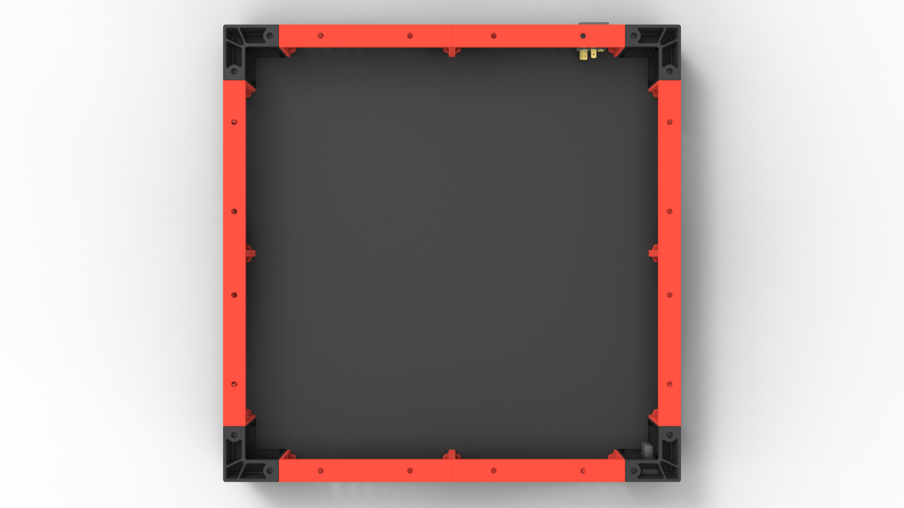
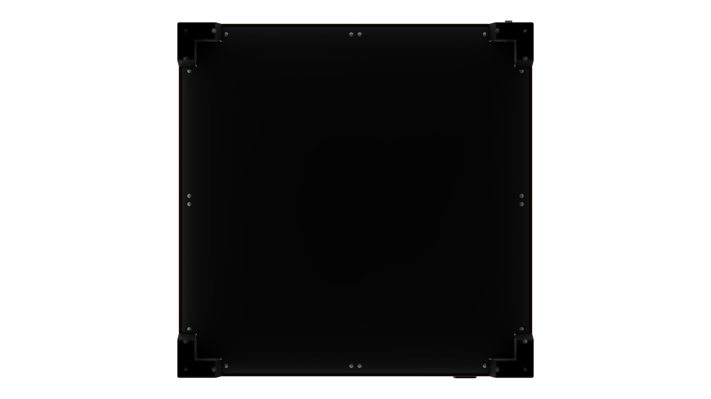

---

title: Welcome
nav_order: 1
---

# Welcome to the ZeroG docs!

Our first attempt at documentation! Found any errors in this document? Please report it on our [Discord server](https://discord.com/invite/gzJP2s8).

This contains all the information you need to build your personal ZeroG printer.

If you're not an expert with cad we'd suggest you to read our Documentation carefully. Do you have any questions? Hit up our [Discord](https://discord.com/invite/gzJP2s8){:target="_blank"}!

## Projects we're working on

### Higher resolution image

Hovering an image with your mouse will show a zoom icon <i class="bi bi-zoom-in"></i> after opening the image you can either click 'CLOSE' or anywhere on the screen to close the pop-up.

### Mercury 1.1

Read more about Mercury 1.1 [here](#)
{: .fs-3 .fw-300 }

### Hydra

Read more about Hydra [here](/manual/build/hydra).
{: .fs-3 .fw-300 }

{: .lightbox_wrapper}

    

    

        
        
    

  

    More Hydra screenshots
  

Front view
{: .fs-3 .fw-300 }

{: .lightbox_wrapper}

    

    

        
        
    

---

Back view
{: .fs-3 .fw-300 }

{: .lightbox_wrapper}

    

    

        
        
    

---

Top view
{: .fs-3 .fw-300 }

{: .lightbox_wrapper}

    

    

        
        
    

---

Bare Hydra components
{: .fs-3 .fw-300 }

{: .lightbox_wrapper}

    

    

        
        
    

### Electronics Enclosure

Read more about the Electronics Enclosure [Soon](#).
{: .fs-3 .fw-300 }

{: .lightbox_wrapper}

    

    

        
        
    

  

    More Electronics Enclosure screenshots
  

Front view
{: .fs-3 .fw-300 }

{: .lightbox_wrapper}

    

    

        
        
    

---

Back view
{: .fs-3 .fw-300 }

{: .lightbox_wrapper}

    

    

        
        
    

---

Top view
{: .fs-3 .fw-300 }

{: .lightbox_wrapper}

    

    

        
        
    

---

Bottom view
{: .fs-3 .fw-300 }

{: .lightbox_wrapper}

    

    

        
        
    

