# Mainsail theme

Mainsail custom theme installation instructions.
{: .fs-6 .fw-300 }

Skill required - easy
{: .label .label-red }

[Screenshot](#screenshot)

---

<details closed markdown="block">
  <summary>
    Table of contents
  </summary>
1. TOC
{:toc}
</details>


## Connect to SSH

Open your SSH client, in my case [Putty](https://www.putty.org/){:target="_blank"}.

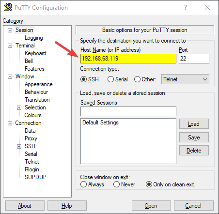{: class="roundcorners"}

Connect to your Raspberry using the SSH client, **your local ip is different** than mine.

---

### SSH console

Your console should look simulair to this.

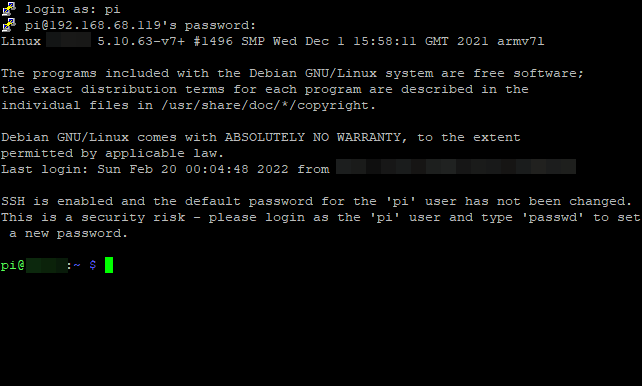{: class="roundcorners"}

---

### Console Commands

Copy the following code into your console.

```s
    cd ~/
    git clone https://github.com/ZeroGDesign/zerog-mainsail-theme.git
    bash ~/zerog-mainsail-theme/install.sh
```

After pasting them into the console, it should look simulator to this.

{: class="roundcorners"}


{: .warn }
The input field still shows a command we have to run, press **ENTER** on your keyboard to run the command.

Our console now reads the text '*Theme has been installed, have fun!*' this part is now complete.

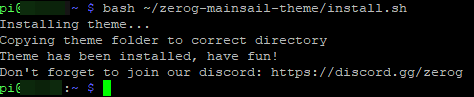{: class="roundcorners"}

---

## Machine Settings

For the next part of the instructions you'll be using your webclient.
{: .fs-6 .fw-300 }

Open the webclient of your printer, on the left side you'll see the menu, click on '*Machine*'.

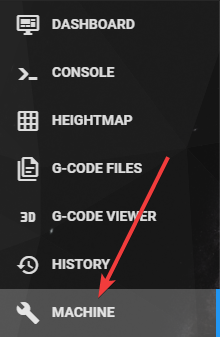{: class="roundcorners"}

---

### Config Files

Look for the file '*moonraker.conf*' and press it.

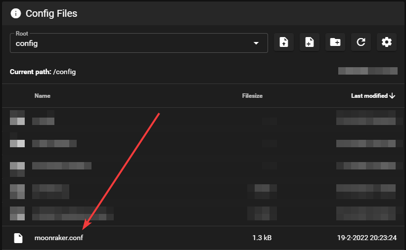{: class="roundcorners"}

---

## Adding Update Script

Scroll down and locate the text *[update_manager]*.

{: .note }
Some users may find an additional line "enable_auto_refresh: True", if this is included, don't remove and start on the next line

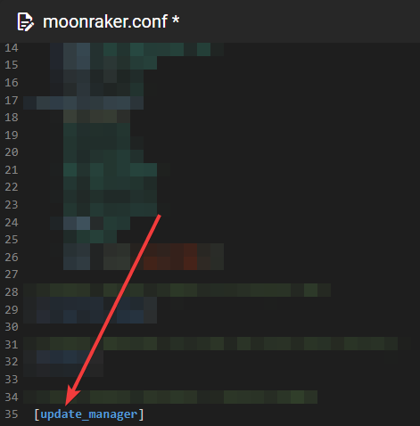{: class="roundcorners"}

Add the following code:

```s
    [update_manager client ZeroGTheme]
    type: git_repo
    path: ~/zerog-mainsail-theme
    origin: https://github.com/ZeroGDesign/zerog-mainsail-theme.git
    install_script: /home/pi/zerog-mainsail-theme/install.sh
    is_system_service: False
```

---

Now it should look something like this.

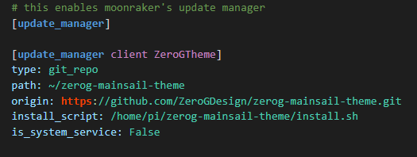{: class="roundcorners"}

---

### Save & Restart

Click on **Save & Restart**

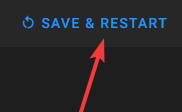{: class="roundcorners"}

---

### Restart Moonraker

A notification will appear that asks you to **try again**. Click this notification.

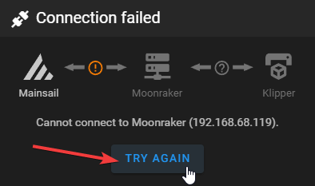{: class="roundcorners"}

---

### Refresh your browser

Try to refresh your browser, it should show the ZeroG theme.

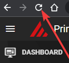{: class="roundcorners"}

---

### Update manager

On the right you'll find the **Update Manager**, you'll notice that **ZeroGTheme** has been added.

This will allow you to grab the latest updates once we release them for the ZeroG Mainsail Theme.

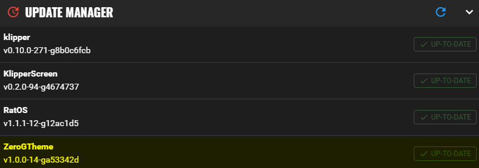{: class="roundcorners"}

---

### Screenshot

Enjoy your fresh ZeroG Theme.

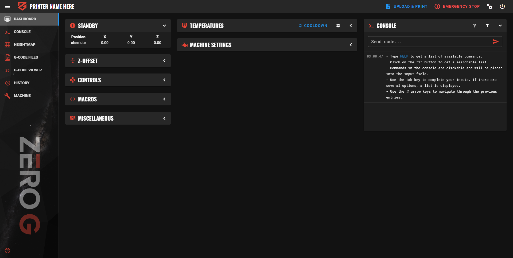{: class="roundcorners"}
