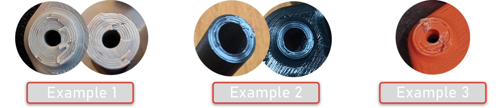

## Printing parts

### What material should I use?
ZeroG printers are designed to be printed using ABS or ASA. This means we've included tolerances for material shrinkage in our models.

It's recommended to print your ABS or ASA parts inside of an enclosure, this will greatly increase layer strenght.

{: .note}
We find that parts printed in ABS+ are **weaker in layer adhesion** compared to non ABS+ filaments. Although easier to print, they're **easier to break**.
 We're aware that not every blend of ABS+ is equal, however it's what we found with the ABS+ we tested.

### I am looking for a calibration print
Check it out now! You can find it [here](https://www.printables.com/model/369447-zerog-abs-callibration-print). This test print will assist you in determining the proper fitment of dowel pins, heatsets, and bolts, as well as testing the bridging and overhangs. The printable page's description will provide you with the necessary settings to use.

### My print broke, oh no!
Great! Lets use this moment to check your layer adheasion. We mostly use our Steppers mounts or X Joints to check the adheasion.

Below you'll find a picture of a collection of breaks, on how it **should** look.

Hover the image and click to enlarge <i class="bi bi-zoom-in"></i>
{: .fs-3 .fw-300 }

{: .lightbox_wrapper}

    

    

        
        
    

#### XJoint break - Example 1
Example 1 shows a break going across multiple layers. A break on multiple layers indicates good layer adheasion.

#### Stepper mount break - Example 2
Example 2 shows white stress marks on the break but nothing on multiple layers. White stress mark on plastic indicates force was needed to seperate the layers.

#### XJoint break - Example 3
Example 3 shows one flaw, the part has been printed with a .6 nozzle showing a gap between the outer perimeter and the inner perimeters. It's still a strong part, the break goes across multiple layers.

### Filament brands that we recommend

* [Polymaker](https://us.polymaker.com?aff=282){:target="_blank"}
* Bambulab
* Keene Village Plastics

#### Filament colors we do NOT recommend
White - You can, but we don't recommend it. The pigment shows a ton of flaws and causes weak layer adheasion.

<!-- #### The difference between ABS, ABS+, ASA and TitanX
A quote from [https://all3dp.com/](https://all3dp.com/2/abs-plus-filament-what-is-it/){:target="_blank"} 
> "ABS+, or ABS Plus, aims to reduce the sensitivity to shrinkage and warping of ABS, while preserving most of its performance advantages." -->

[Recommended print settings click here](/standard/print/settings){: .btn .btn-red }